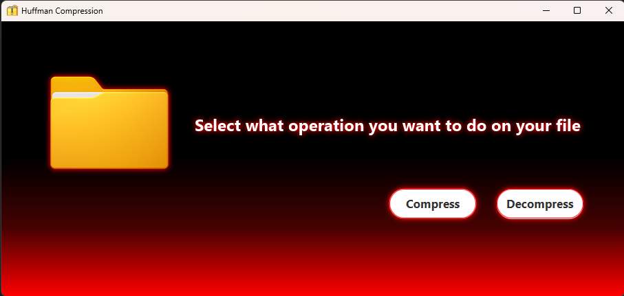
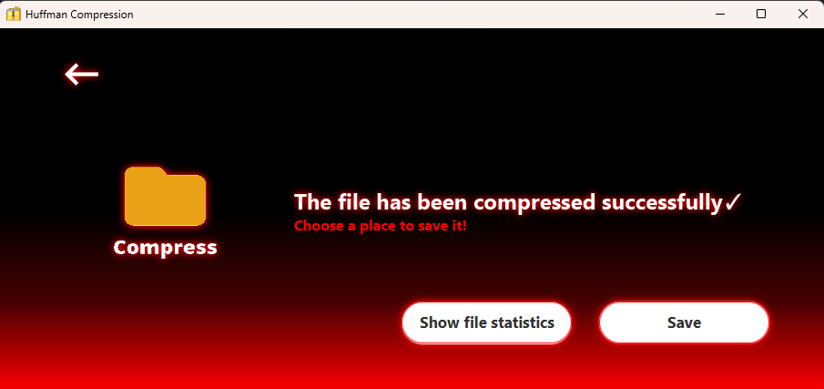
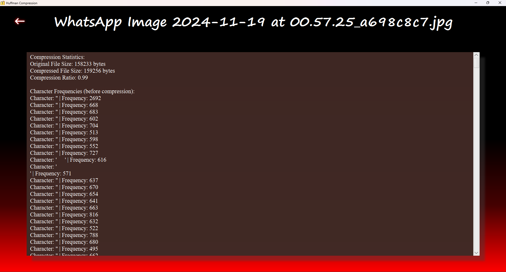
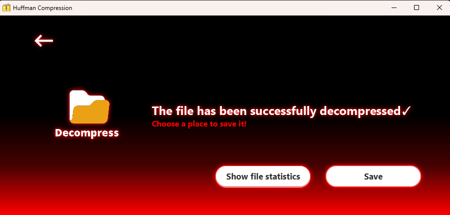
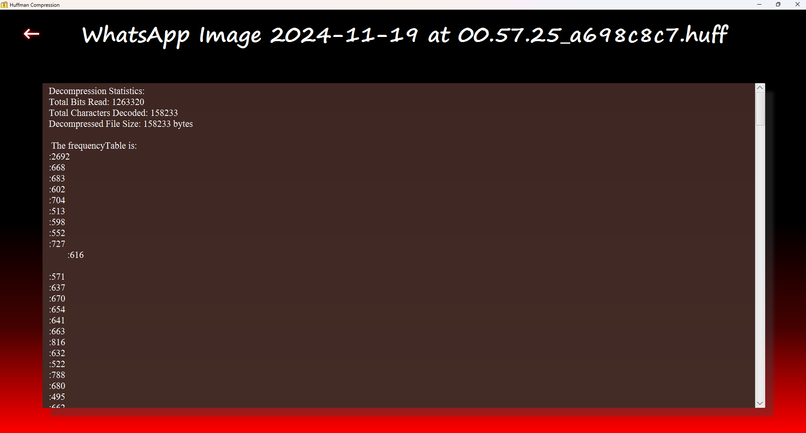

# 🗜️ Huffman Coding Compression Tool  

This project implements **Huffman Coding**, a lossless data compression algorithm, to efficiently compress and decompress files. Huffman coding assigns **variable-length binary codes** to characters based on their frequency, ensuring optimal data representation and storage efficiency.  

---

## 📝 Problem Statement  

File compression is essential for **reducing storage requirements** and **improving data transmission speeds**. Traditional compression methods may not always be optimized for specific file types, leading to unnecessary storage consumption. The challenge is to create an efficient compression algorithm that:  

- Reduces file sizes significantly.  
- Maintains **data integrity** (lossless compression).  
- Processes files efficiently in a **user-friendly** way.  
- Allows **quick access** to compression/decompression via a **right-click menu** in the file explorer.  

---

## 💡 Solution  

This project provides a **graphical user interface (GUI)** that enables users to **compress** and **decompress** files using Huffman coding.  

### 🔄 Compression Process  

1. **File Analysis** – Reads the file and calculates the frequency of each character.  
2. **Huffman Tree Construction** – Builds a binary tree based on character frequencies.  
3. **Encoding Process** – Assigns unique binary codes to each character.  
4. **File Compression** – Encodes the file using the Huffman codes and saves the compressed version.  
5. **Statistics Display** – Shows compression ratios and other relevant file data.  

### 🔁 Decompression Process  

1. **Reads the compressed file**.  
2. **Reconstructs the Huffman tree** from the encoded header.  
3. **Decodes the compressed data** and restores the original file.  
4. **Displays decompression statistics** to confirm the process was successful.  

---

## ✨ Features  

✅ **Lossless Compression** – Ensures no data loss during compression and decompression.  
✅ **Right-Click Integration** – Allows users to compress/decompress files directly from the file explorer context menu.  
✅ **GUI-Based Interaction** – A user-friendly interface for easier file selection and processing.  
✅ **File Statistics Display** – Provides insights into file size before and after compression.  
✅ **Efficient Huffman Encoding** – Optimized implementation using a priority queue and binary tree.  

---

## 📸 Screenshots  

### 🏠 Home Page – Choose between compression and decompression  
  

### 📂 Compress Page – Displays file statistics before compression  
  

### 📉 Compressed File Statistics – View compression results  
  

### 📂 Decompress Page – Shows file statistics before decompression  
  

### 📈 Decompressed File Statistics – Confirms successful restoration  
  

---

## 🚀 How to Use  

### 1️⃣ **Using the Application (GUI Mode)**  

1. **Open the application** and choose either **Compress** or **Decompress**.  
2. **Select a file** from your computer.  
3. **View file statistics** (size, compression ratio, etc.).  
4. Click **Compress** to generate a `.huff` compressed file.  
5. Click **Decompress** to restore the original file.  

### 2️⃣ **Using the Right-Click Context Menu**  

1. **Right-click** on any file in your file explorer.  
2. Select **"Compress with Huffman"** or **"Decompress with Huffman"**.  
3. The file will be processed immediately, and results will be displayed.  

